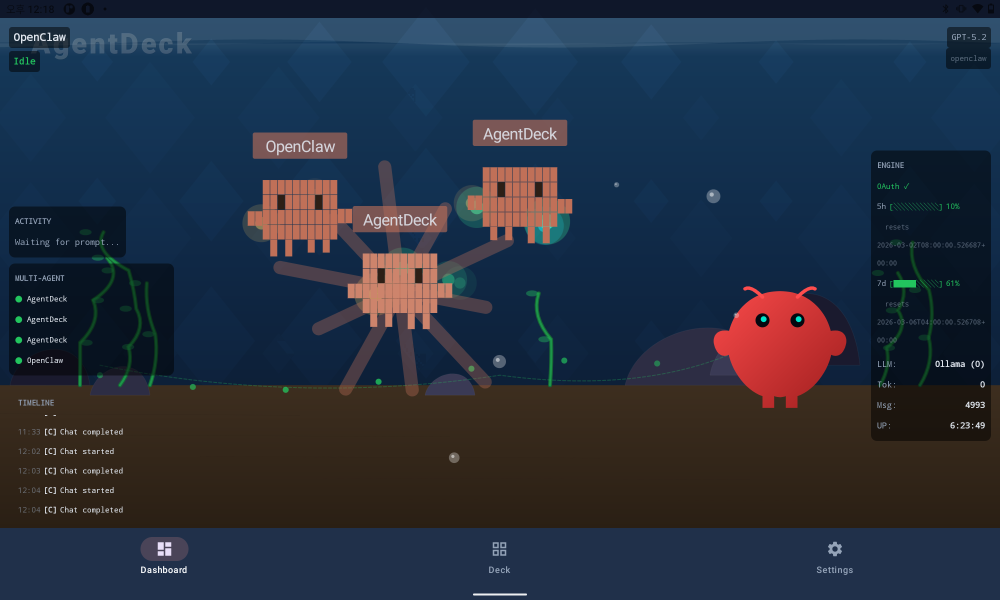
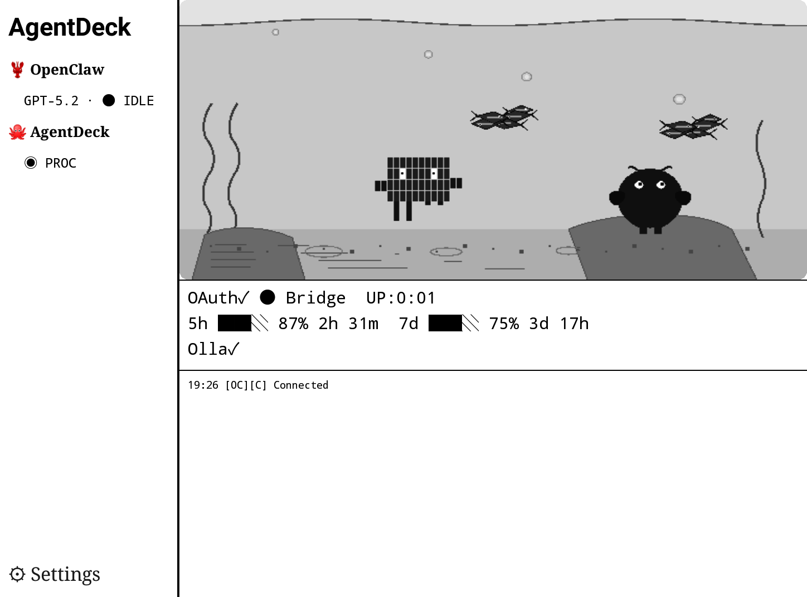

# AgentDeck

**Stop Chatting. Start Steering.**

AgentDeck turns your Elgato Stream Deck+ into a physical control surface for AI coding agents like Claude Code and OpenClaw.

> Control sessions. Interrupt runs. Switch modes. Monitor usage.
> Steer your AI — without leaving your keyboard flow.

<p align="center">
  
</p>

<p align="center">
  <a href="https://youtu.be/zVzrcaahdEs"><strong>Watch Demo on YouTube</strong></a>
</p>

<p align="center">
  <video src="docs/media/demo-clip.mp4" width="720" controls muted autoplay loop playsinline>
    <a href="docs/media/demo-clip.mp4">Watch demo clip</a>
  </video>
</p>

| | Requirement |
|---|---|
| **Platform** | macOS 14+ (Sonoma) — Windows/Linux not supported |
| **Hardware** | Elgato Stream Deck+ (8 keys, 4 encoders, LCD touch strip) |
| **Terminal** | iTerm2 (required for session management and voice paste) |
| **Android** | *(Optional)* Android 10+ tablet or e-ink reader for remote dashboard |

---

## Table of Contents

- [What is AgentDeck?](#what-is-agentdeck)
- [Prerequisites](#prerequisites)
- [Quick Start](#quick-start)
- [Manual Build & Install](#manual-build--install)
- [Usage](#usage)
- [Stream Deck+ Layout (v3)](#stream-deck-layout-v3)
- [Android Dashboard](#android-dashboard)
- [State Machine](#state-machine)
- [WebSocket Protocol](#websocket-protocol)
- [Project Structure](#project-structure)
- [Configuration](#configuration)
- [Troubleshooting](#troubleshooting)
- [Packaging & Distribution](#packaging--distribution)
- [Uninstall](#uninstall)
- [Development](#development)
- [Roadmap](#roadmap)
- [Button Label Intelligence](#button-label-intelligence)

---

## What is AgentDeck?

AgentDeck is not a chat app, a plugin, or a shortcut collection.

It's a **control surface** — like an audio mixing console or a video color panel, but for AI coding agents. It reads your agent's state in real-time and dynamically reconfigures buttons and encoders to match what's happening right now.

| What it does | How |
|---|---|
| **Respond instantly** to permission prompts | YES / NO / ALWAYS buttons appear with semantic colors (green/red/blue) |
| **Interrupt** a runaway agent | STOP button sends Ctrl+C |
| **Switch modes** on the fly | Mode button cycles Plan / Accept Edits / Default |
| **Navigate options** physically | Encoder scrolls and selects multi-choice prompts; wide-canvas LCD shows all options |
| **Speak to your agent** | Push-to-talk voice → whisper.cpp transcription → auto-send. Works offline |
| **See suggestions** | Claude Code ghost text (autocomplete) appears on the Action encoder LCD |
| **Monitor usage** | Animated water-gauge dashboard with 5h / 7d / extra / session pages |
| **Run quick actions** | GO ON / REVIEW / COMMIT / CLEAR buttons; encoder cycles custom prompts |
| **Control system utilities** | Volume, mic, media playback, timer — all from the Utility encoder |
| **Manage terminal sessions** | iTerm dial switches sessions, auto-attaches detached tmux, auto-switches on tab focus |
| **Stay in flow** | Hardware augments your keyboard — never interrupts it |
| **Control from anywhere** | Commands work even when the terminal is in the background — no need to switch windows |

The bridge stays transparent: if it's off, Claude Code works exactly as before.

### Supported Agents

| Agent | Status |
|-------|--------|
| **Claude Code** | Supported (primary) |
| **OpenClaw** | Experimental — Gateway WebSocket, timeline panel, log stream |

### Supported Surfaces

| Surface | Status |
|---------|--------|
| **Stream Deck+** | Primary — 8 keys, 4 encoders, LCD touch strip |
| **Android Tablet** | Color terrarium + HUD overlay (60fps) |
| **Android E-ink** | B&W aquarium + partial refresh (A2/DU/FULL) |

### Architecture

```
┌──────────────────────┐   WebSocket (ws://localhost:9120)   ┌────────────────────┐
│  Stream Deck Plugin  │◄───────────────────────────────────►│   Bridge Server    │
│  (Node.js, SDK v2)   │   state updates ← / → commands     │   (Node.js)        │
│                      │                                     │                    │
│  8 Keys              │                                     │  ┌──────────────┐  │
│  4 Encoders + LCD    │                                     │  │ PTY Manager  │  │
└──────────────────────┘                                     │  │ (node-pty)   │  │
                                                             │  └──────┬───────┘  │
                                                             │         │          │
┌──────────────────────┐                                     │  ┌──────▼───────┐  │
│  User's Terminal     │◄──stdio proxy──────────────────────►│  │ claude CLI   │  │
│  (iTerm2)            │  user sees claude normally          │  └──────┬───────┘  │
└──────────────────────┘                                     │         │ output   │
                                                             │  ┌──────▼───────┐  │
┌──────────────────────┐   HTTP POST (hook JSON on stdin)    │  │ Output       │  │
│  Claude Code Hooks   │────────────────────────────────────►│  │ Parser       │  │
│  (settings.json)     │   structured events                 │  └──────┬───────┘  │
└──────────────────────┘                                     │         │          │
                                                             │  ┌──────▼───────┐  │
                                                             │  │ State        │  │
                                                             │  │ Machine      │  │
                                                             │  └──────┬───────┘  │
                                                             │         │          │
                                                             │  ┌──────▼───────┐  │
                                                             │  │ WS Server    │  │
                                                             │  │ :9120        │  │
                                                             │  └──────────────┘  │
                                                             │                    │
                                                             │  ┌──────────────┐  │
                                                             │  │ Voice        │  │
                                                             │  │ whisper.cpp  │  │
                                                             │  └──────────────┘  │
                                                             └────────┬───────────┘
                                                                      │
┌──────────────────────┐   WebSocket (ws://LAN:9120) + mDNS          │
│  Android Dashboard   │◄────────────────────────────────────────────►│
│  (Jetpack Compose)   │   SSE / state updates / voice transcribe
│  E-ink / Tablet      │
└──────────────────────┘
```

**Multi-surface control (macOS host + Stream Deck + Android)**
- The macOS bridge (`sdc`) listens on `0.0.0.0:9120`; local clients are auto-trusted, LAN clients must present the auth token stored at `~/.agentdeck/auth-token`.
- Stream Deck plugin connects locally; Android tablet/e-ink app connects over the same WebSocket (pair via `sdc qr`) and mirrors encoder LCDs and buttons.
- Bridge computes encoder state and relays the Stream Deck slot map. If the plugin is absent, Android falls back to the v3 default layout while staying fully controllable.
- Voice from Android uploads WAV to `POST /voice/transcribe`; utility actions (volume/brightness/media/timer) go through the bridge’s macOS `osascript` proxy, so either surface can monitor and steer the agent independently or simultaneously.

---

## Prerequisites

| Item | Required | Install |
|------|----------|---------|
| **macOS 14+** (Sonoma) | Yes | Windows/Linux not supported |
| **Node.js** >= 20 | Yes | `brew install node` |
| **pnpm** | Yes | `npm install -g pnpm` |
| **Elgato Stream Deck app** >= 6.7 | Yes | [Elgato Downloads](https://www.elgato.com/downloads) |
| **Stream Deck+ hardware** | Yes | 8 keys + 4 encoders + LCD touch strip |
| **iTerm2** | Yes | Terminal management, voice paste, session switching |
| **Claude Code CLI** | Yes | `npm install -g @anthropic-ai/claude-code` |
| **Stream Deck CLI** | Auto | Installed by `pnpm setup` if missing |
| **sox** (audio capture) | For voice | See [Voice Setup](#4-voice-setup-optional) |
| **whisper.cpp** (transcription) | For voice | See [Voice Setup](#4-voice-setup-optional) |

---

## Quick Start

```bash
# Option A: npm install (no clone needed)
npx @agentdeck/setup

# Option B: from source
git clone https://github.com/puritysb/AgentDeck.git && cd AgentDeck && pnpm setup
```

The `pnpm setup` command:
1. Checks required dependencies (Node.js 20+, pnpm, Claude CLI, Stream Deck app)
2. Installs `@elgato/cli` if missing
3. Runs `pnpm install` + `pnpm build`
4. Generates icon assets (16 PNGs)
5. Installs Claude Code hooks
6. Links the Stream Deck plugin
7. Links the `sdc` CLI globally
8. Checks optional dependencies (sox, whisper.cpp)

After setup, **restart the Stream Deck app**, then run:

```bash
sdc
```

You're steering.

---

## Manual Build & Install

### Build

```bash
cd AgentDeck
pnpm install
pnpm build            # shared → bridge, plugin, hooks
pnpm generate-icons   # SVG → PNG (required on first build)
```

Build output:
- `shared/dist/` — shared type definitions
- `bridge/dist/` — bridge server + `sdc` CLI
- `plugin/.sdPlugin/bin/plugin.js` — Stream Deck plugin bundle
- `hooks/dist/` — hook installer
- `plugin/.sdPlugin/static/imgs/` — icon assets (16 PNGs)

### 1. Install Claude Code Hooks

The bridge receives structured events (tool calls, session lifecycle, etc.) via hooks:

```bash
node hooks/dist/install.js
```

Registers 7 hooks in `~/.claude/settings.local.json`:
- `SessionStart`, `SessionEnd`, `PreToolUse`, `PostToolUse`, `Stop`, `Notification`, `UserPromptSubmit`

Each hook POSTs JSON to the bridge's HTTP server. If the bridge is down, `|| true` ensures Claude is unaffected.

To remove hooks:
```bash
node hooks/dist/install.js uninstall
```

### 2. Link Stream Deck Plugin

```bash
cd plugin
streamdeck link .sdPlugin
```

Creates a symlink in `~/Library/Application Support/com.elgato.StreamDeck/Plugins/`. **Restart the Stream Deck app** to load the plugin.

### 3. Link `sdc` CLI

```bash
cd bridge
pnpm link --global
```

The `sdc` command is now available globally.

### 4. Voice Setup (Optional)

Voice input requires **sox** (audio capture) and **whisper.cpp** (local transcription).

- **arm64 Homebrew** (`/opt/homebrew/`) required on Apple Silicon — x86 Homebrew runs through Rosetta without Metal GPU (10-20x slower)
- **Binaries needed**: `rec` (from sox), `whisper-cli` and `whisper-server` (from whisper-cpp)
- **Whisper model**: `~/.local/share/whisper-cpp/` or Homebrew share dir — `large-v3-turbo` recommended (~1.5GB)
- **GPU memory**: ~1.8GB (shared across sessions, one whisper-server instance)

#### Apple Silicon (M1/M2/M3/M4)

> **Important:** You must use **arm64 Homebrew** (`/opt/homebrew/`). The x86 Homebrew (`/usr/local/`) installs Intel binaries that run through Rosetta 2 without Metal GPU — transcription will be 10-20x slower.

```bash
# Check your Homebrew architecture
brew --prefix
# /opt/homebrew  → arm64 (correct)
# /usr/local     → x86 (need to install arm64 Homebrew)
```

If you only have x86 Homebrew:
```bash
# Install arm64 Homebrew (coexists with x86, doesn't affect it)
arch -arm64 /bin/bash -c "$(curl -fsSL https://raw.githubusercontent.com/Homebrew/install/HEAD/install.sh)"

# Add to your shell profile (~/.zshrc)
eval "$(/opt/homebrew/bin/brew shellenv)"
```

Install with arm64 Homebrew:
```bash
/opt/homebrew/bin/brew install sox whisper-cpp
```

#### Intel Mac

```bash
brew install sox whisper-cpp
```

#### Download Whisper Model

```bash
whisper-cli --download-model large-v3-turbo   # ~1.5GB, best quality/speed balance
```

Models are saved to `~/.local/share/whisper-cpp/`. The bridge auto-selects the best available model:

| Model | Size | Speed (M1 Max, Metal) | Accuracy | Best for |
|-------|------|----------------------|----------|----------|
| `large-v3-turbo` | 1.5GB | ~3-5s for 10s audio | Excellent | Recommended for Apple Silicon |
| `small` | 466MB | ~2-3s | Good | Limited disk space |
| `base` | 148MB | ~1-2s | Fair | Fallback (auto-selected if no Metal) |

#### Verify Setup

```bash
# Check binary is arm64 with Metal (Apple Silicon)
file $(which whisper-cli)
# → Mach-O 64-bit executable arm64  ← correct

otool -L $(which whisper-cli) | grep metal
# → libggml-metal.0.dylib  ← Metal GPU enabled
```

The bridge auto-detects Metal support at startup and logs:
```
[Voice] whisper-cli: arm64=true, metal=true (/opt/homebrew/bin/whisper-cli)
[Voice] Selected whisper model: ~/.local/share/whisper-cpp/ggml-large-v3-turbo.bin
```

---

## Usage

### Start

```bash
sdc
```

This starts the bridge on port 9120 (HTTP + WebSocket), spawns Claude Code inside a PTY, and proxies your terminal transparently. Use Claude exactly as before — the Stream Deck adds a parallel control channel.

> **Security:** The bridge binds to `0.0.0.0` for LAN access (multi-surface monitoring). Local connections bypass authentication. Remote connections require the auth token from `~/.agentdeck/auth-token`.

### CLI Commands

```bash
sdc status           # check bridge/session state
sdc stop             # end session
sdc --port 9200      # custom port
sdc --command 'claude --model opus'  # custom Claude command
```

---

## Stream Deck+ Layout (v3)

<p align="center">
  
</p>

### Keypad — 8 Actions

```
┌────────┬─────────┬─────────┬───────────┐
│  MODE  │ SESSION │  USAGE  │  GO ON    │
├────────┼─────────┼─────────┼───────────┤
│ REVIEW │ COMMIT  │  CLEAR  │   STOP    │
└────────┴─────────┴─────────┴───────────┘
```

| Slot | Action | Description |
|------|--------|-------------|
| 0 | **Mode** | Toggle Default / Plan / Accept Edits |
| 1 | **Session** | Project name + state + session switch |
| 2 | **Usage** | Usage dashboard (5h / 7d / extra / session / models / oc-usage pages) |
| 3–6 | **Quick Action ×4** | GO ON / REVIEW / COMMIT / CLEAR when idle — up to 4 options on permission/select prompt. 5+ options → 3 + MORE ▼ |
| 7 | **Stop** | Interrupt (Ctrl+C when processing) / Escape (when idle) |

### Encoders — 4 Slots

| Encoder | Action | Rotate | Push | Touch |
|---------|--------|--------|------|-------|
| E1 | **Utility** | Adjust value (volume, mic, timer) | Toggle / Action | Switch mode |
| E2 | **Action** | Scroll options / cycle prompts | Send prompt / Confirm | Same as push |
| E3 | **Terminal** | Switch iTerm session | Activate / Attach tmux | — |
| E4 | **Voice** | Scroll transcription text | Hold = record, tap (<500ms) = cancel | — |

#### Utility Dial Modes (E1)

The Utility encoder supports multiple modes, switchable via touch (long press ≥500ms):

| Mode | Rotate | Push | Display |
|------|--------|------|---------|
| **Volume** | Adjust output volume (±5%) | Toggle mute | Volume % + bar |
| **Mic** | Adjust input volume (±5%) | Toggle mute | Input level + bar |
| **Media** | Adjust volume | Play / Pause | Track + artist (Spotify / Music.app) |
| **Timer** | Adjust time (±5 min) | Start / Pause / Reset | Countdown + bar |

#### Action Dial Features (E2)

- **IDLE**: Cycles through prompt templates (rotate) and sends on push. If Claude Code shows a ghost text suggestion (autocomplete), it appears as the first prompt option
- **Interactive**: Scrolls options (rotate) and confirms selection (push). For navigable prompts with `❯` cursor, arrow keys move the cursor in the PTY

#### Voice Dial Features (E4)

- **Recording**: Hold push to record, release to transcribe. Pulsing red indicator with waveform animation
- **Voice Text Takeover**: After transcription, the text spans all 4 encoder LCDs (wide canvas, adaptive font 48→16px). Short push (<500ms) = send to Claude, long push (≥500ms) = cancel
- **Offline-first**: Recording works even when bridge is disconnected — text is pasted via clipboard

<p align="center">
  
  &nbsp;&nbsp;
  
</p>
<p align="center"><em>Left: Voice transcription (Korean) on wide-canvas LCD &nbsp;|&nbsp; Right: Model selection with encoder option list</em></p>

### Dynamic Button States

Slots 3–6 (quick actions) and slot 7 (stop/escape) reconfigure based on agent state. Slots 0–2 (Mode, Session, Usage) always remain in place.

#### Semantic Button Colors

Permission and diff response buttons are automatically color-coded by intent:

| Color | Hex | Meaning | Matched by |
|-------|-----|---------|------------|
| Green | `#166534` | Approve | shortcut `y`/`a`, or label starts with *Yes* / *Allow* / *Apply* |
| Red | `#991b1b` | Deny | shortcut `n`/`d`, or label starts with *No* / *Deny* |
| Blue | `#1e40af` | Permanent | label starts with *Always*, or contains *Don't ask again* / *Allow all sessions* |
| Teal | `#1e3a5f` | Other | Default for unrecognized options |

Option buttons (non-permission) use teal `#1e3a5f` by default, green `#1e4d2b` for recommended options.

#### Per-State Layout

**IDLE** — waiting for user input

```
┌─────────┬─────────┬─────────┬─────────┐
│  MODE   │ SESSION │  USAGE  │  GO ON  │  ← teal
├─────────┼─────────┼─────────┼─────────┤
│ REVIEW  │ COMMIT  │  CLEAR  │   ESC   │  ← slate, dim ESC
└─────────┴─────────┴─────────┴─────────┘
```

| Slot | Default Label | Color | Action |
|------|---------------|-------|--------|
| 3 | GO ON | teal `#1e3a2f` | Send `continue` prompt |
| 4 | REVIEW | slate `#1e293b` | Send `/review` |
| 5 | COMMIT | slate `#1e293b` | Send `/commit` |
| 6 | CLEAR | slate `#1e293b` | Send `/clear` |
| 7 | ESC | dim `#3d2607` | Send escape key |

All four quick-action labels and commands are customizable per-instance via the Stream Deck Property Inspector.

**PROCESSING** — agent working

```
┌─────────┬─────────┬─────────┬─────────┐
│  MODE   │ SESSION │  USAGE  │  START  │  ← blue
├─────────┼─────────┼─────────┼─────────┤
│ REVIEW  │ COMMIT  │  CLEAR  │  STOP   │  ← greyed out, red STOP
└─────────┴─────────┴─────────┴─────────┘
```

| Slot | Label | Color | Action |
|------|-------|-------|--------|
| 3 | START | blue `#0f3460` | Open project picker, spawn parallel `sdc` session |
| 4–6 | *(idle labels, greyed out)* | dim `#1a1a1a` | Disabled — labels remain visible but inactive |
| 7 | **STOP** | red `#cc0000` | Send Ctrl+C interrupt |

START appears only on slots with a `disconnectedAction` configured (default: slot 3 runs `sdc`).

**AWAITING_PERMISSION** — tool/file approval prompt

```
┌─────────┬─────────┬─────────┬─────────┐
│  MODE   │ SESSION │  USAGE  │   YES   │  ← green
├─────────┼─────────┼─────────┼─────────┤
│   NO    │ ALWAYS  │ DON'T…  │   ESC   │  ← red, blue, blue, orange
└─────────┴─────────┴─────────┴─────────┘
```

Up to 4 options from the bridge, each auto-colored by semantic matching (see color table above). A typical Claude Code permission prompt shows: *Yes, allow once* (green) / *No, deny* (red) / *Always allow* (blue) / *Don't ask again for this tool* (blue). If the bridge sends no structured options, the fallback is hardcoded YES / NO / ALWAYS.

| Slot | Color rule | Action |
|------|------------|--------|
| 3–6 | Semantic (green / red / blue / teal) | `respond:{shortcut}` |
| 7 | ESC — orange `#b45309` | Cancel prompt |

**AWAITING_OPTION** — multi-choice selection (≤4 options)

```
┌─────────┬─────────┬─────────┬─────────┐
│  MODE   │ SESSION │  USAGE  │  Opt 1  │  ← teal (green if recommended)
├─────────┼─────────┼─────────┼─────────┤
│  Opt 2  │  Opt 3  │  Opt 4  │   ESC   │  ← teal, orange ESC
└─────────┴─────────┴─────────┴─────────┘
```

**AWAITING_OPTION** — multi-choice selection (5+ options)

```
┌─────────┬─────────┬─────────┬─────────┐
│  MODE   │ SESSION │  USAGE  │  Opt 1  │
├─────────┼─────────┼─────────┼─────────┤
│  Opt 2  │  Opt 3  │ MORE ▼  │   ESC   │  ← gray MORE, orange ESC
└─────────┴─────────┴─────────┴─────────┘
```

Badges: ★ on recommended option (green `#1e4d2b`), ✓ on currently selected. MORE ▼ (gray `#334155`) triggers encoder takeover — wide-canvas LCD across E2–E4 shows the full scrollable list.

**AWAITING_DIFF** — file edit review

```
┌─────────┬─────────┬─────────┬─────────┐
│  MODE   │ SESSION │  USAGE  │  APPLY  │  ← green
├─────────┼─────────┼─────────┼─────────┤
│  DENY   │  VIEW   │  (dim)  │   ESC   │  ← red, teal, orange ESC
└─────────┴─────────┴─────────┴─────────┘
```

Same semantic coloring as permission. Fallback if no options from bridge: APPLY (green) / DENY (red) / VIEW (teal).

**DISCONNECTED** — no active session

```
┌─────────┬─────────┬─────────┬─────────┐
│  (dim)  │  (dim)  │  USAGE  │  START  │  ← blue
├─────────┼─────────┼─────────┼─────────┤
│  (dim)  │  (dim)  │  (dim)  │  (dim)  │
└─────────┴─────────┴─────────┴─────────┘
```

| Slot | Label | Color | Action |
|------|-------|-------|--------|
| 3 | START | blue `#0f3460` | Open project picker, run `sdc` |
| 4–6 | — | dim `#1a1a1a` | Disabled |
| 7 | STOP | dim red `#3a1111` | Disabled |

START appears on any slot with `disconnectedAction` configured. Mode and Session dim; Usage remains active (independent render loop).

### Terminal Dial (E3) — iTerm Session Manager

The Terminal encoder provides full iTerm2 session management:

| Action | Behavior |
|--------|----------|
| **Rotate** | Cycle through iTerm sessions + focus the selected window/tab |
| **Push** | Activate the selected session. If it's a detached tmux session, opens a new iTerm window and attaches |
| **Auto-switch** | When you focus an iTerm tab that belongs to an AgentDeck session, the bridge auto-switches to that session (2s polling) |

Detached tmux sessions from AgentDeck appear in the list with a 🔌 prefix (e.g. `🔌 ViewLingo`). Pushing on these opens a new iTerm window and runs `tmux attach`.

The **Session button** long press also focuses the terminal — if the tmux session is detached, it auto-attaches in a new iTerm window.

### Encoder Takeover (Wide Canvas)

When Claude presents options, permissions, or diff prompts, the encoder LCDs switch to a **wide canvas** mode:

| Encoder | Panel | Content |
|---------|-------|---------|
| E1 | **Context** | State indicator (color-coded), question text, cursor position |
| E2–E4 | **Option List** | 600px-wide scrollable list with highlight, badges (★ recommended, ✓ selected), semantic colors |

<p align="center">
  
</p>

Rotate E2 to scroll, push to confirm. The wide canvas auto-scrolls to keep the selected option visible. When the prompt is answered, all encoders restore to their normal displays.

---

## Android Dashboard

Monitor and control your AI agents from any Android device — no Stream Deck required.

<p align="center">
  
  &nbsp;&nbsp;
  
</p>
<p align="center"><em>Left: Tablet mode (color terrarium + HUD) &nbsp;|&nbsp; Right: E-ink mode (Crema S, B&W aquarium)</em></p>

The Android app connects to the same bridge server over your local network, giving you a second screen for agent monitoring and a full mirror of the Stream Deck controls.

### Two Display Modes

**E-ink mode** (Crema S, Onyx, Kobo)
- Aquarium-centered B&W dashboard — pixel art creatures in a 16-level grayscale terrarium
- Partial refresh zones: A2 (200ms) for fast UI, DU for status, FULL (500ms) for the aquarium
- Left panel (22%): agent list with state indicators
- Right panel (78%): aquarium + rate limits/models + event timeline

**Tablet mode** (Lenovo, general Android tablets)
- Full-color terrarium background with 60fps creature animation
- Semi-transparent HUD panels overlay agent status, rate limits, timeline
- Identical information to e-ink, expressed through color and motion

### Terrarium Creatures

The aquarium is more than decoration — creatures respond to agent state in real-time:

| Creature | Agent | Behavior |
|----------|-------|----------|
| **Octopus** (14×5 pixel grid) | Claude Code | PROCESSING → starburst animation + tentacle wave. IDLE → rests near the sand. Per-session instances with name hats |
| **Crayfish** (SVG path art) | OpenClaw | ROUTING → claw clap + signal waves + eye flash. SITTING → heartbeat glow (4s double-pulse) |
| **Neon Tetra** (14 fish, 2 schools) | Ambient | Boids flocking with Lissajous school paths. Attracted to active agents — swim toward data particles during PROCESSING |

### Displayed Information

- **Agent status**: type, session name, model, state (IDLE / PROCESSING / AWAITING)
- **Rate limits**: 5h and 7d usage gauges with reset countdown timers
- **Models**: OAuth-connected models + locally running Ollama models
- **Event timeline**: tool calls, model calls, state changes — timestamped log
- **Connection**: bridge status, billing type, uptime

### Three-Tab Navigation

| Tab | Content |
|-----|---------|
| **Dashboard** | Terrarium background + HUD overlay panels. Connection overlay when disconnected (mDNS discovery, QR pairing) |
| **Deck** | Full Stream Deck+ mirror — 4 encoder panels (swipe/tap/long-press gestures) + 2×4 button grid with context area |
| **Settings** | Bridge connection, display preferences |

### Supported Devices

| Device | Chip | EPD API |
|--------|------|---------|
| **Crema S** | Rockchip RK3566 | `android.os.EinkManager` — `setMode()` + `sendOneFullFrame()` |
| **Onyx Boox** | — | `BaseDevice.setViewDefaultUpdateMode()` |
| **Kobo** (via Android) | — | Fallback `invalidate()` |
| **General tablets** | — | Standard Android rendering (color, 60fps) |

### Build & Install

```bash
# Build APK locally (requires JDK 17+)
bash scripts/build-android-release.sh    # → dist/agentdeck-v{VERSION}.apk

# Or download from GitHub Releases
# git tag android-v{VERSION} && git push origin android-v{VERSION}  → CI builds APK
```

### Connect to Bridge

The app finds your bridge automatically:

1. **mDNS** — the bridge advertises `_agentdeck._tcp` on your local network; the app discovers it within seconds
2. **QR pairing** — run `sdc qr` on your Mac, scan with the app's camera (CameraX + ML Kit)
3. **Manual** — enter the bridge IP and port in Settings

Once connected, the app receives real-time state updates over WebSocket and can send commands (button presses, encoder gestures, voice transcription) back to the bridge.

---

## State Machine

The bridge combines hook events and PTY output parsing to maintain 6 states:

```
                    ┌──────────────┐
         ┌─────────│ DISCONNECTED │◄──── SessionEnd hook / PTY closed
         │         └──────────────┘
         │ sdc start
         ▼
    ┌──────────┐  Stop hook / idle detected
    │   IDLE   │◄─────────────────────────────────┐
    └────┬─────┘                                  │
         │ UserPromptSubmit hook / spinner         │
         ▼                                        │
    ┌──────────────┐  permission prompt detected  │
    │  PROCESSING  │──────────────────────┐       │
    └──┬───────┬───┘                      │       │
       │       │                          ▼       │
       │       │                ┌─────────────┐   │
       │       │                │  AWAITING   │   │
       │       │                │  PERMISSION │───┘ user responds (y/n/a)
       │       │                └─────────────┘
       │       │ diff prompt detected
       │       ▼
       │  ┌──────────────┐
       │  │  AWAITING    │
       │  │  DIFF        │────────────────────────┘ user responds (v/a/d)
       │  └──────────────┘
       │ option UI detected
       ▼
    ┌──────────────┐
    │  AWAITING    │
    │  OPTION      │──────────────────────────────┘ user selects option
    └──────────────┘
```

| State | Description | Detection |
|-------|-------------|-----------|
| `DISCONNECTED` | No session | `SessionEnd` hook, PTY exit |
| `IDLE` | Waiting for prompt | `Stop` hook, `❯` idle pattern |
| `PROCESSING` | Agent working | `UserPromptSubmit` hook, spinner (✢✳✶✻✽) |
| `AWAITING_PERMISSION` | Yes/No response needed | `Yes, allow once` / `(y/n)` pattern |
| `AWAITING_OPTION` | Selection needed | Numbered list / `❯` navigable cursor |
| `AWAITING_DIFF` | Diff review | `(V)iew/(A)pply/(D)eny` pattern |

---

## WebSocket Protocol

Communication between the bridge (port 9120) and the Stream Deck plugin.

### Bridge → Plugin

```typescript
// State change (includes tool context, options, cursor, suggested prompt)
{ type: 'state_update', state: 'processing', permissionMode: 'default', currentTool: 'Read',
  toolInput: 'src/index.ts', navigable: false, suggestedPrompt: 'fix the bug' }

// Prompt options (backward-compat, options-only)
{ type: 'prompt_options', promptType: 'yes_no_always', options: [{ index: 0, label: 'Yes' }, ...] }

// Usage stats (session + API-sourced plan usage)
{ type: 'usage_update', sessionDurationSec: 120, inputTokens: 5000, outputTokens: 3000, toolCalls: 7,
  fiveHourPercent: 42, sevenDayPercent: 15, extraUsageEnabled: true }

// Connection status
{ type: 'connection', status: 'connected' }

// Voice recording state
{ type: 'voice_state', state: 'recording' }  // idle | recording | transcribing | error

// User prompt echo (text user typed in terminal)
{ type: 'user_prompt', text: 'fix the login bug' }
```

### Plugin → Bridge

```typescript
{ type: 'respond', value: 'y' }              // Yes/No/Always response (shortcut char)
{ type: 'select_option', index: 2 }          // Option selection (0-based, sends Enter)
{ type: 'navigate_option', direction: 'down' } // Cursor movement for navigable lists
{ type: 'send_prompt', text: 'fix the bug' } // Send prompt text
{ type: 'switch_mode', mode: 'plan' }        // Mode switch (Shift+Tab)
{ type: 'interrupt' }                        // Ctrl+C
{ type: 'escape' }                           // Esc key (cancel prompt/selection)
{ type: 'voice', action: 'start' }           // Voice record start/stop/cancel
{ type: 'query_usage' }                      // Refresh API usage data
```

---

## Project Structure

```
AgentDeck/
├── shared/                       # Shared type definitions
│   └── src/
│       ├── index.ts              # Re-exports
│       ├── states.ts             # State enum, transitions, StateSnapshot
│       ├── protocol.ts           # WebSocket event/command types, constants
│       └── voice-paths.ts        # Shared binary/model path constants (rec, whisper)
│
├── bridge/                       # Bridge server (PTY + Hook + WS + Voice)
│   └── src/
│       ├── index.ts              # sdc CLI entry (commander)
│       ├── pty-manager.ts        # node-pty wrapper: spawn, proxy, interrupt
│       ├── output-parser.ts      # ANSI parsing + pattern matching
│       ├── hook-server.ts        # HTTP POST receiver (Claude Code hooks)
│       ├── state-machine.ts      # Hook + PTY event → state management
│       ├── ws-server.ts          # WebSocket server (plugin comms)
│       ├── session-registry.ts   # Multi-session registry (~/.agentdeck/sessions.json)
│       ├── usage-tracker.ts      # Session usage tracking (tokens, cost)
│       ├── usage-api.ts          # Anthropic API usage fetch (OAuth + Keychain)
│       ├── voice.ts              # sox capture + whisper.cpp transcription
│       ├── whisper-server-manager.ts  # Singleton whisper-server lifecycle (port 9100)
│       ├── adapters/
│       │   ├── index.ts              # createAdapter() factory
│       │   ├── claude-code.ts        # ClaudeCodeAdapter (PTY + Parser + HookServer)
│       │   └── openclaw.ts           # OpenClawAdapter (Gateway WebSocket)
│       ├── check-deps.ts         # Runtime dependency check
│       ├── logger.ts             # Structured logging
│       └── types.ts              # Bridge-local types + shared re-exports
│
├── plugin/                       # Stream Deck SDK v2 plugin
│   ├── src/
│   │   ├── plugin.ts             # SDK entry, action registration, takeover guard
│   │   ├── bridge-client.ts      # WebSocket client (auto-reconnect)
│   │   ├── connection-manager.ts # Bridge > Gateway priority, event forwarding
│   │   ├── gateway-client.ts     # Direct Gateway connection, Ed25519 auth
│   │   ├── agent-link.ts         # AgentLink interface (send/isConnected/getCapabilities)
│   │   ├── timeline-store.ts     # OC event store, grouping, disk persist, NOW marker
│   │   ├── log-stream.ts         # openclaw logs --follow --json → timeline events
│   │   ├── layout-manager.ts     # State-driven button/encoder layout
│   │   ├── encoder-takeover.ts   # Encoder wide-canvas takeover (option/permission)
│   │   ├── encoder-registry.ts   # String ID → action lookup (no stale references)
│   │   ├── expanded-actions.ts   # 5+ option expanded keypad mode
│   │   ├── label-summarizer.ts   # Haiku CLI fallback for long button labels
│   │   ├── voice-local.ts        # Local voice recording (bridge-independent)
│   │   ├── project-scanner.ts    # Project directory scanner
│   │   ├── project-picker.ts     # Project/session picker UI
│   │   ├── log.ts                # Plugin logger
│   │   ├── actions/
│   │   │   ├── response-button.ts    # Quick Action buttons (×4, configurable)
│   │   │   ├── stop-button.ts        # Interrupt / Escape
│   │   │   ├── mode-button.ts        # Mode toggle (Default/Plan/Accept)
│   │   │   ├── session-button.ts     # Session info + project switch
│   │   │   ├── usage-button.ts       # Usage dashboard (animated water gauge)
│   │   │   ├── option-dial.ts        # Action encoder: scroll options / cycle prompts
│   │   │   ├── utility-dial.ts       # Utility encoder: volume/mic/media/timer
│   │   │   ├── iterm-dial.ts         # Terminal encoder: iTerm session manager
│   │   │   └── voice-dial.ts         # Voice encoder: push-to-talk + transcription
│   │   ├── renderers/
│   │   │   ├── button-renderer.ts    # SVG button image (pixel-aware text + abbreviation)
│   │   │   ├── option-renderer.ts    # Encoder LCD option list (wide canvas)
│   │   │   ├── response-renderer.ts  # Action encoder LCD state rendering
│   │   │   ├── timeline-renderer.ts  # OC timeline fisheye SVG (400px wide canvas)
│   │   │   ├── utility-renderer.ts   # Utility mode LCD panels
│   │   │   ├── iterm-renderer.ts     # Terminal session LCD panel
│   │   │   ├── voice-renderer.ts     # Voice status / transcription LCD
│   │   │   ├── agent-logos.ts        # Claude + OpenClaw SVG logo paths
│   │   │   └── text-utils.ts         # CJK-aware text measurement + wrapping
│   │   └── utility-modes/
│   │       ├── index.ts              # Mode registry and lifecycle
│   │       ├── types.ts              # UtilityMode interface
│   │       ├── macos.ts              # macOS system APIs (osascript, iTerm, paste)
│   │       ├── volume.ts             # Output volume control
│   │       ├── mic.ts                # Input volume / microphone control
│   │       ├── media.ts              # Media playback (Spotify / Music.app)
│   │       ├── timer.ts              # Countdown timer
│   │       ├── brightness.ts         # Display brightness
│   │       └── darkmode.ts           # Dark mode toggle
│   ├── .sdPlugin/
│   │   ├── manifest.json         # Stream Deck plugin manifest
│   │   ├── bin/                  # Build output (plugin.js)
│   │   ├── layouts/              # Encoder LCD layouts (voice-layout.json, option-pixmap-layout.json)
│   │   └── static/imgs/         # Icon assets
│   └── rollup.config.mjs        # Bundle config
│
├── hooks/                        # Claude Code hook installer
│   └── src/
│       └── install.ts            # Register/unregister hooks in settings.local.json
│
├── setup/                        # npm setup package (@agentdeck/setup)
│   └── src/
│       └── setup.ts              # npx @agentdeck/setup entry point
│
├── android/                      # Android dashboard app (Jetpack Compose)
│   ├── app/src/main/kotlin/
│   │   └── dev/agentdeck/
│   │       ├── net/              # WebSocket client, protocol parsing
│   │       ├── state/            # AgentState, mDNS discovery
│   │       ├── terrarium/        # Creature animation, renderer, e-ink engine
│   │       ├── ui/monitor/       # Tablet HUD panels (activity, engine, timeline)
│   │       ├── ui/eink/          # E-ink components (status, agent panel, aquarium)
│   │       ├── ui/deck/          # SD+ mirror (buttons, encoder strip)
│   │       └── ui/screen/        # Screen composables (Dashboard, Deck, Settings)
│   └── build.gradle.kts          # minSdk 29, CATEGORY_HOME launcher
│
├── config/
│   ├── prompt-templates.json     # Prompt templates (encoder prompt cycling)
│   └── default-settings.json     # Defaults (port, voice, timeouts)
│
├── scripts/
│   ├── install.sh                # One-click setup (pnpm setup)
│   ├── uninstall.sh              # Remove everything
│   ├── package-plugin.sh         # Build .streamDeckPlugin (pnpm package)
│   └── generate-icons.mjs        # SVG → PNG icon generation
│
├── package.json                  # pnpm workspaces root
├── pnpm-workspace.yaml
├── tsconfig.base.json
├── CLAUDE.md
└── README.md
```

---

## Configuration

### Quick Action Buttons

The four Quick Action buttons (slots 3–6) are configurable via the Stream Deck Property Inspector. Defaults:

| Slot | Label | Action |
|------|-------|--------|
| 3 | GO ON | `continue` (sends prompt to continue) |
| 4 | REVIEW | `/review` |
| 5 | COMMIT | `/commit` |
| 6 | CLEAR | `/clear` |

Slot 3 also shows **START** when disconnected (spawns a new `sdc` session).

### Prompt Templates

Edit `config/prompt-templates.json` to customize the prompts cycled by the **Action encoder** (E2) rotate:

```json
{
  "templates": [
    { "label": "Fix Bug", "prompt": "Please fix the bug described above" },
    { "label": "Test", "prompt": "Write tests for the changes made" },
    { "label": "Review", "prompt": "Review the code for issues and suggest improvements" },
    { "label": "Explain", "prompt": "Explain how this code works step by step" }
  ]
}
```

---

## Troubleshooting

| Symptom | Cause | Fix |
|---------|-------|-----|
| Plugin shows DISCONNECTED | Bridge not running | Run `sdc` |
| Plugin reconnects every 3s | Bridge crashed | Restart `sdc` |
| Bridge enters disconnected state | Claude process exited | Restart `sdc` |
| State tracking not working | Hook server unreachable | Verify `sdc` is running |
| Stream Deck buttons inactive | Hardware not connected | Reconnect + restart app |
| Stuck in PROCESSING > 5 min | Agent stalled | STOP button or Ctrl+C in terminal |
| "Is sox installed?" | sox missing | See [Voice Setup](#4-voice-setup-optional) |
| "Is whisper.cpp installed?" | whisper.cpp missing | See [Voice Setup](#4-voice-setup-optional) |
| Voice transcription very slow / timeout | x86 whisper-cli (no Metal GPU) | Install arm64 Homebrew + whisper-cpp. See [Voice Setup](#4-voice-setup-optional) |
| `whisper-cli: arm64=false, metal=false` | Using x86 binary through Rosetta | Install arm64 Homebrew at `/opt/homebrew/` |
| Plugin not in Stream Deck app | Plugin not linked | Restart Stream Deck app, then `cd plugin && streamdeck link .sdPlugin` |
| Hooks not firing | Hooks not installed or stale | `node hooks/dist/install.js` (re-installs all 7 hooks) |
| Need to remove hooks | Uninstalling AgentDeck | `node hooks/dist/install.js uninstall` |
| Plugin loads but buttons blank | Plugin needs rebuild | `pnpm build && pnpm generate-icons`, restart Stream Deck app |

### tmux -CC Compatibility

When using iTerm2's `tmux -CC` (control mode): run `sdc` inside a tmux window. The bridge manages its own PTY, so there's no conflict.

Signal chain: `tmux → iTerm2 → sdc → bridge PTY → claude`

---

## Packaging & Distribution

Build a distributable `.streamDeckPlugin` file:

```bash
pnpm package
```

This builds the project, zips `plugin/.sdPlugin`, and outputs `dist/bound.serendipity.agentdeck.streamDeckPlugin`.

Recipients double-click the file to install in the Stream Deck app. The bridge (`sdc`) and Claude Code CLI must be installed separately.

> **Note:** Native binaries (sox, whisper.cpp) cannot be bundled in the plugin and must be installed by the user.

### npm Packages

Published to npm (public):
- `@agentdeck/shared` — shared types
- `@agentdeck/bridge` — bridge server + `sdc` CLI
- `@agentdeck/setup` — one-command installer (`npx @agentdeck/setup`)

---

## Uninstall

```bash
bash scripts/uninstall.sh
```

Removes Claude Code hooks, unlinks `sdc` CLI, and removes the Stream Deck plugin symlink. **Restart the Stream Deck app** afterward.

---

## Development

```bash
pnpm -r --parallel dev    # Watch mode for all packages
cd plugin && pnpm build   # Rebuild plugin only
cd bridge && pnpm build   # Rebuild bridge only
pnpm -r typecheck         # Type check without building
```

### Testing

```bash
pnpm test                 # Run all tests (vitest)
pnpm test -- --watch      # Watch mode
```

Tests cover output parsing, state machine transitions, hook installation, option rendering, and text utilities. Quick smoke test after changes:

```bash
pnpm build && pnpm test && sdc status
```

### Debugging

Bridge logs print to the `sdc` terminal:
```
[sdc] Starting AgentDeck bridge on port 9120...
[sdc] Hook server listening on port 9120
[sdc] WebSocket server ready on port 9120
[sdc] Spawned: claude
[WsServer] Plugin connected
[StateMachine] DISCONNECTED -> idle (trigger: session_start, source: hook)
```

Stream Deck plugin logs: Stream Deck app → Settings → Logs.

---

## Roadmap

### Completed
- ~~OpenClaw integration~~ — Adapter, Gateway WebSocket, timeline panel (3-layer), log stream
- ~~Agent-agnostic bridge protocol~~ — AgentAdapter interface, multi-agent command routing
- ~~Multi-surface monitoring~~ — mDNS discovery, auth tokens, SSE, remote WebSocket
- ~~Android dashboard~~ — E-ink terrarium (Crema/Onyx/Kobo) + tablet HUD, SD+ Deck mirroring, voice transcription
- ~~npm publish~~ — `@agentdeck/shared`, `@agentdeck/bridge`, `@agentdeck/setup` on npm

### Remaining
- ~~Plugin capability gating per agent (UI adaptation)~~
- Project-specific layout presets
- Custom button icon support
- Windows/Linux platform support

---

## Button Label Intelligence

Permission and option labels can be long (e.g. "Yes, allow and don't ask again"). AgentDeck uses a 3-tier system to fit them on 144×144px buttons:

| Tier | Method | Latency | Example |
|------|--------|---------|---------|
| 1. **Pixel-aware wrap** | CJK-aware text measurement + multi-line wrap | Instant | "Yes, allow once" → fits as-is |
| 2. **Local abbreviation** | Pattern-based heuristic (known phrases) | Instant | "Yes, I trust this folder" → "Trust folder" |
| 3. **Haiku summarization** | `claude -p --model haiku` CLI fallback | ~1-3s | Unknown long label → AI-shortened version |

- **CJK support**: Korean, Chinese, and Japanese characters are measured at double-width (1em vs 0.55em for Latin), preventing overflow on CJK labels
- **Haiku fallback**: Only triggers when tiers 1-2 fail. First render shows ellipsis (`…`), then re-renders with the AI summary once it arrives. Results are cached (200 entries) so repeated labels are instant
- **Abbreviated indicator**: Buttons that were shortened show a subtle `~` mark at the bottom-right corner
- **Wide canvas unaffected**: Encoder LCD option lists (E2-E4) have enough horizontal space to display full labels without abbreviation

> **Requirement**: Tier 3 (Haiku) requires Claude Code CLI (`claude`) installed and authenticated. Subscription accounts work — no separate API key needed.

---

<p align="center">
<strong>AgentDeck</strong> — Physical Control Surface for AI Coding Agents
</p>
